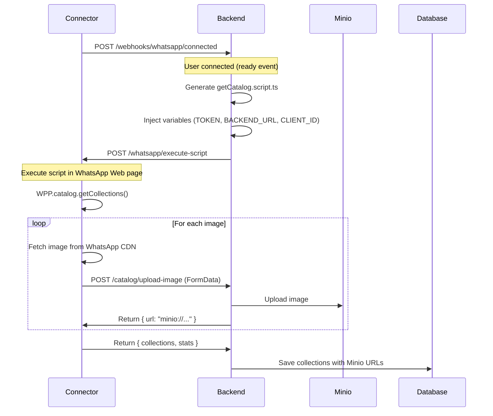
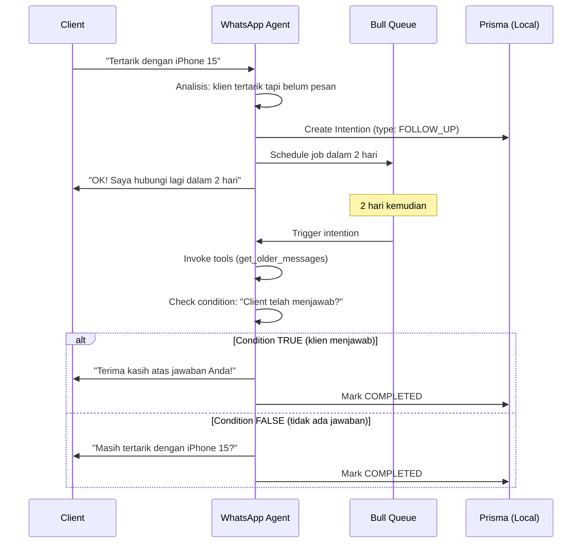

# Arsitektur Terpisah Connector ↔ Backend

## Tujuan

Memisahkan tanggung jawab antara **WhatsApp Connector** (klien murni) dan **Backend**
(orkestrator) untuk:

- Meminimalkan redeployment connector (sensitif karena terhubung ke WhatsApp)
- Memusatkan logika bisnis di backend
- Memungkinkan evolusi fitur tanpa menyentuh connector

---

## Arsitektur

### **Connector** (whatsapp-connector)

**Peran**: Klien murni WhatsApp Web

#### Tanggung Jawab:

- Terhubung ke WhatsApp Web melalui `whatsapp-web.js`
- Mengirim event melalui webhook (`ready`, `qr`, `message`, dll.)
- Menyediakan endpoint untuk **menjalankan kode** di halaman WhatsApp Web
- TIDAK LAGI: Logika bisnis, download/upload gambar, pemrosesan data

### **WhatsApp Agent** (whatsapp-agent)

**Peran**: Agent AI terdesentralisasi untuk bisnis harian

#### Tanggung Jawab:

- **AI & LangChain**: Pemrosesan pesan cerdas dengan tools
- **Niat**: Pengelolaan pengingat cerdas (follow-up, tindak lanjut)
- **Memori**: Penyimpanan lokal preferensi dan konteks klien
- **Katalog lokal**: Cache dengan embeddings untuk pencarian semantik
- **Queue**: Pemrosesan asinkron niat terjadwal

#### Database lokal:

- `ConversationMemory`: Memori persisten klien
- `Intention`: Niat terjadwal dengan kondisi
- `ScheduledMessage`: Pesan terjadwal (queue)
- `CatalogProduct`: Katalog lokal dengan embeddings

#### Komunikasi dengan Backend:

- `POST /agent/can-process`: Memeriksa apakah boleh memproses pesan
- `POST /agent/log-operation`: Mencatat metrik (token, tools, durasi)
- TIDAK MELAKUKAN: Onboarding, penagihan, konfigurasi global

#### Endpoint yang disediakan:

```
POST /whatsapp/execute-script
Body: { script: string }
```

Menjalankan JavaScript dalam konteks halaman WhatsApp Web (akses ke `window.WPP`).

#### Konfigurasi:

```env
CONNECTOR_SECRET=your-secret      # Untuk menandatangani webhook
WEBHOOK_URLS=http://backend/...   # URL yang akan diberi tahu
```

---

### **Backend** (apps/backend)

**Peran**: Orkestrator terpusat - Onboarding, Penagihan, Konfigurasi

#### Tanggung Jawab:

- **Onboarding**: Mengelola proses pendaftaran klien
- **Penagihan**: Pelacakan kredit, langganan, pembayaran
- **Konfigurasi**: WhatsAppAgent, grup yang diizinkan, konteks bisnis
- **Log & Analitik**: Penyimpanan AgentOperation (token, durasi, tools)
- **Orkestrasi Connector**: Pembuatan dan pengiriman skrip ke connector
- **Penyimpanan terpusat**: Minio untuk gambar/avatar, DB untuk konfigurasi global

#### Yang TIDAK Dilakukan Backend:

- Pemrosesan AI pesan (didelegasikan ke WhatsApp-Agent)
- Pengelolaan niat dan pengingat (didelegasikan ke WhatsApp-Agent)
- Cache katalog dengan embeddings (didelegasikan ke WhatsApp-Agent)
- Memori percakapan (didelegasikan ke WhatsApp-Agent)

#### Workflow - Pengambilan katalog



---

## Struktur File

### Backend

```
apps/backend/src/
├── page-scripts/                    # Skrip yang dijalankan di halaman WhatsApp
│   ├── getCatalog.script.ts        # Skrip pengambilan katalog
│   ├── page-script.service.ts      # Service templating ({{VAR}})
│   └── page-script.module.ts
│
├── catalog/                         # Modul katalog
│   ├── catalog.controller.ts       # POST /catalog/upload-image
│   ├── catalog.service.ts          # Logika pengelolaan gambar
│   └── catalog.module.ts
│
├── minio/                           # Modul Minio (S3)
│   ├── minio.service.ts            # Upload/download ke Minio
│   └── minio.module.ts
│
├── webhooks/                        # Webhook connector
│   ├── webhooks.controller.ts      # Menerima event
│   └── webhooks.module.ts
│
└── connector-client/                # Klien HTTP ke connector
    └── connector-client.service.ts # executeScript()
```

### Connector

```
apps/whatsapp-connector/src/
├── whatsapp/
│   ├── whatsapp-client.service.ts  # Klien WhatsApp (disederhanakan)
│   ├── whatsapp.controller.ts      # POST /execute-script
│   └── webhook.service.ts          # Mengirim webhook dengan tanda tangan
│
└── catalog/                         # MODUL DIHAPUS
```

---

## Konfigurasi

### Backend (.env)

```env
# Connector
WHATSAPP_CONNECTOR_BASE_URL=http://localhost:3001
CONNECTOR_SECRET=your-shared-secret

# Minio
MINIO_ENDPOINT=files-example.com
MINIO_PORT=443
MINIO_USE_SSL=true
MINIO_ACCESS_KEY=your-key
MINIO_SECRET_KEY=your-secret
MINIO_BUCKET=whatsapp-agent
```

### Connector (.env)

```env
# Webhook
WEBHOOK_URLS=http://backend:3000/webhooks/whatsapp/connected

# Keamanan
CONNECTOR_SECRET=your-shared-secret   # Sama dengan backend
```

---

## Keamanan

### Tanda tangan webhook

Connector menandatangani semua webhook dengan HMAC-SHA256:

**Connector**:

```typescript
const signature = crypto
  .createHmac('sha256', CONNECTOR_SECRET)
  .update(JSON.stringify(payload))
  .digest('hex')

headers['X-Connector-Signature'] = signature
```

**Backend**:

```typescript
@UseGuards(ConnectorSignatureGuard)  // Memverifikasi tanda tangan
async whatsappConnected(@Body() data) { ... }
```

---

## Skrip Halaman

### Contoh: getCatalog.script.ts

```javascript
// Dijalankan dalam konteks halaman WhatsApp Web
const collections = await window.WPP.catalog.getCollections(userId, 50, 100)

for (const product of products) {
  const blob = await fetch(imageUrl).then(r => r.blob())

  const formData = new FormData()
  formData.append('image', blob)
  formData.append('productId', product.id)

  // Upload ke backend
  await fetch('{{BACKEND_URL}}/catalog/upload-image', {
    method: 'POST',
    headers: { Authorization: 'Bearer {{TOKEN}}' },
    body: formData,
  })
}
```

### Placeholder yang tersedia:

- `{{BACKEND_URL}}`: URL backend
- `{{TOKEN}}`: Token autentikasi
- `{{CLIENT_ID}}`: ID klien WhatsApp

---

## Deployment

### Keunggulan arsitektur ini:

1. **Connector stabil**: Tidak perlu sering redeploy
2. **Backend fleksibel**: Modifikasi logika tanpa menyentuh connector
3. **Skalabilitas**: Satu connector bisa melayani beberapa backend
4. **Maintainability**: Pemisahan tanggung jawab yang jelas

### Workflow deployment:

**Untuk fitur baru**:

1. Buat skrip baru di `apps/backend/src/page-scripts/`
2. Tambahkan endpoint pemrosesan di backend
3. Picu skrip dari webhook
4. Tidak perlu menyentuh connector

**Connector hanya berubah jika**:

- Update `whatsapp-web.js`
- Tipe event baru yang harus didengarkan
- Masalah stabilitas/rekoneksi

---

## Pemisahan Tanggung Jawab

### Backend (Terpusat) vs WhatsApp-Agent (Terdesentralisasi)

| Fitur | Backend (Terpusat) | WhatsApp-Agent (Terdesentralisasi) |
|---|---|---|
| **Onboarding** | Pengelolaan penuh | - |
| **Penagihan** | Kredit, langganan | - |
| **Konfigurasi Agent** | Konteks bisnis, grup | - |
| **Log & Analitik** | Penyimpanan AgentOperation | Pengiriman metrik |
| **AI & Pesan** | - | LangChain + Tools |
| **Niat** | - | Pengelolaan lokal |
| **Memori** | - | Penyimpanan lokal |
| **Katalog** | Sumber kebenaran | Cache + embeddings |

### Mengapa arsitektur ini?

1. **Skalabilitas**:
   - 1 VPS = 1 klien → Beban terdistribusi
   - Backend ringan → Menangani ribuan klien

2. **Performa**:
   - Agent lokal → Respons instan
   - Tidak ada latensi jaringan untuk setiap pesan

3. **Isolasi**:
   - Crash satu agent → Tidak mempengaruhi yang lain
   - Data bisnis terisolasi per VPS

4. **Biaya**:
   - Agent menggunakan sumber daya sendiri (API keys)
   - Backend hanya membayar untuk konfigurasi/log

---

## Monitoring

### Log yang perlu dipantau

**Connector**:

```
✅ WhatsApp client is ready!
🔍 Executing page script in browser context
```

**Backend**:

```
🚀 Executing catalog script for client: 237697020290@c.us
✅ Image uploaded: 25095720553426064-0 (main)
📦 Catalog received: 2 collections, 15 products, 45 images
```

---

## Sistem Niat (WhatsApp Agent)

### Prinsip

Agent dapat membuat **niat** terjadwal yang memeriksa kondisi sebelum bertindak.

**Contoh**: "Tindak lanjuti klien dalam 2 hari **JIKA** belum menjawab"

### Flow lengkap



### Model data

```typescript
model Intention {
  id        String          @id
  chatId    String
  type      IntentionType   // FOLLOW_UP, ORDER_REMINDER, etc.
  status    IntentionStatus // PENDING → TRIGGERED → COMPLETED

  // Logika
  reason              String @db.Text  // Mengapa niat ini
  conditionToCheck    String @db.Text  // Kondisi yang diperiksa
  actionIfTrue        String? @db.Text // Aksi jika benar
  actionIfFalse       String @db.Text  // Aksi jika salah

  // Timing
  scheduledFor        DateTime

  // Metadata
  metadata            Json?
  createdByRole       String?  // "agent" atau "admin"
}
```

### Tools yang tersedia

#### 1. `schedule_intention`

```typescript
{
  chatId: "237xxx@c.us",
  scheduledFor: "2025-11-29T10:00:00Z",
  type: "FOLLOW_UP",
  reason: "Klien tertarik dengan iPhone 15 Pro",
  conditionToCheck: "Klien telah menjawab pesan",
  actionIfTrue: "Berterima kasih kepada klien",
  actionIfFalse: "Kirim pengingat dengan link produk",
  metadata: JSON.stringify({ productId: "iphone-15-pro" })
}
```

#### 2. `cancel_intention`

```typescript
{
  intentionId: "clx123456"
}
```

**Izin**:
- Agent dapat membatalkan niatnya sendiri
- Admin (di grup) dapat membatalkan semua niat
- Agent TIDAK DAPAT membatalkan niat yang dibuat admin

#### 3. `list_intentions`

```typescript
{
  chatId: "237xxx@c.us"
}
```

Mengembalikan semua niat PENDING untuk klien ini.

### Contoh konkret

**Percakapan:**

```
Klien: "Saya tertarik dengan iPhone 15 Pro Anda"
Agent: "Pilihan bagus! Harganya 1200€. Mau pesan?"
Klien: "Saya pikir-pikir dulu"
Agent: [Buat niat FOLLOW_UP dalam 2 hari]
       "Tidak masalah! Saya hubungi lagi dalam 2 hari 😊"
```

**2 hari kemudian:**

```
Processor: [Picu niat]
           [Panggil agent dengan konteks khusus]

Agent: [Gunakan get_older_messages untuk melihat riwayat]
       [Periksa: Apakah klien menjawab?]

       → JIKA YA: "Terima kasih atas jawaban Anda!"
       → JIKA TIDAK: "Halo! Masih tertarik dengan iPhone 15 Pro? 📱"
```

### Keunggulan

- **Cerdas** - Memeriksa konteks sebelum bertindak
- **Fleksibel** - Agent menggunakan semua tools untuk verifikasi
- **Dapat dibatalkan** - Klien atau admin dapat membatalkan
- **Tertelusur** - Semua status dicatat
- **Terdesentralisasi** - Setiap agent mengelola niatnya sendiri

---

## Kasus Penggunaan

### Menambahkan fitur baru

**Contoh**: Mengambil pesan dari chat

1. Buat `apps/backend/src/page-scripts/getMessages.script.ts`
2. Tambahkan endpoint `POST /messages/upload` di backend
3. Picu dari webhook atau endpoint API
4. Connector **tidak dimodifikasi**!

---

## Checklist Migrasi

- [x] Endpoint `/execute-script` di connector
- [x] Modul `page-scripts` di backend
- [x] Skrip `getCatalog.script.ts` dengan templating
- [x] Endpoint `/catalog/upload-image` di backend
- [x] MinioService di backend
- [x] Orkestrasi dari webhook `ready`
- [x] Tanda tangan HMAC-SHA256 webhook
- [x] Penghapusan CatalogService dari connector
- [x] Tes kompilasi TypeScript

---

## Sumber Daya

- WhatsApp Web.js: https://github.com/pedroslopez/whatsapp-web.js
- WPPConnect wa-js: https://wppconnect.io/wa-js/
- Minio: https://min.io/docs/minio/linux/developers/javascript/minio-javascript.html
