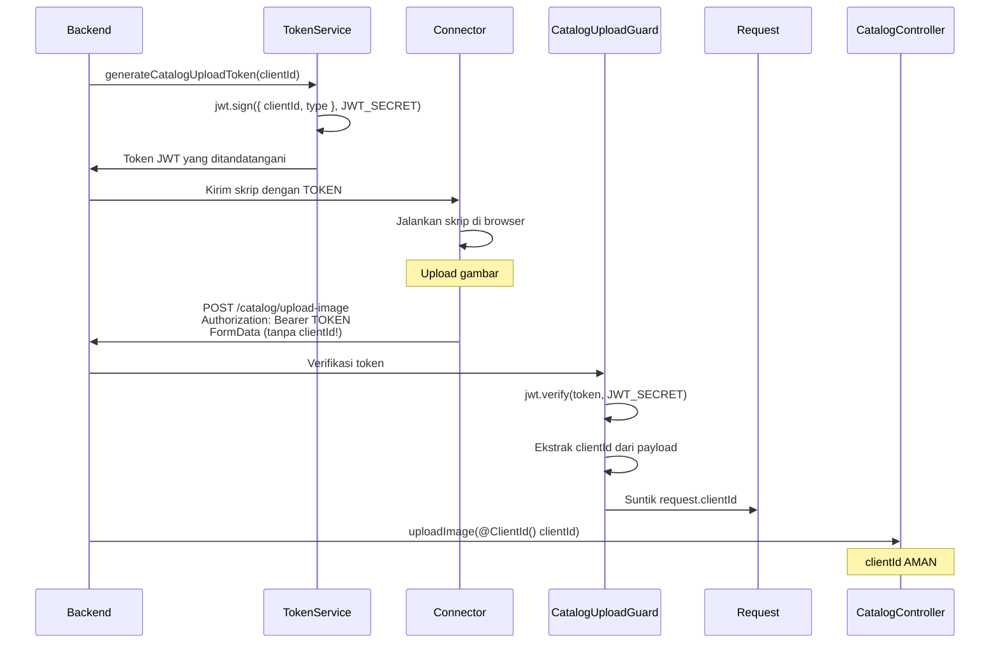

# Keamanan: Token JWT dengan clientId yang dienkode

## Masalah Keamanan yang Teridentifikasi

### Pendekatan awal (tidak aman)

```typescript
// Skrip di browser
formData.append('clientId', CLIENT_ID);  // BAHAYA!

// Backend
async uploadImage(@Body('clientId') clientId: string) {
  // Menggunakan clientId yang dikirim langsung
}
```

**Kerentanan**:

- Penyerang yang mencegat token dapat menentukan `clientId` apa pun
- Penyerang dapat mengupload gambar dengan menyamar sebagai klien lain
- Pencurian identitas dimungkinkan

### Solusi yang diimplementasikan (aman)

```typescript
// Skrip di browser
// clientId TIDAK dikirim dalam FormData

// Backend
@UseGuards(CatalogUploadGuard)
async uploadImage(@ClientId() clientId: string) {
  // clientId DIEKSTRAK dari token JWT yang ditandatangani
}
```

**Keamanan**:

- `clientId` dienkode dalam token JWT yang ditandatangani
- Backend memverifikasi tanda tangan dan mengekstrak `clientId`
- Tidak mungkin mengubah `clientId` tanpa membatalkan token
- Perlindungan terhadap pencurian identitas

---

## Arsitektur Keamanan

### Workflow



---

## File yang Dibuat

### 1. TokenService

**File**: `src/common/services/token.service.ts`

```typescript
generateCatalogUploadToken(clientId: string): string {
  const payload = {
    clientId,
    type: 'catalog-upload',
  };

  return jwt.sign(payload, JWT_SECRET, {
    expiresIn: '1h',  // Token kedaluwarsa setelah 1 jam
  });
}
```

**Tanggung Jawab**:

- Menghasilkan token JWT yang ditandatangani dengan `clientId`
- Tipe token: `catalog-upload` (untuk membedakan dari token lain)
- Kedaluwarsa: 1 jam

### 2. CatalogUploadGuard

**File**: `src/common/guards/catalog-upload.guard.ts`

```typescript
@Injectable()
export class CatalogUploadGuard implements CanActivate {
  canActivate(context: ExecutionContext): boolean {
    const token = extractTokenFromHeader(request)
    const payload = jwt.verify(token, JWT_SECRET)

    // Verifikasi tipe
    if (payload.type !== 'catalog-upload') {
      throw new UnauthorizedException()
    }

    // Suntik clientId ke request
    request.clientId = payload.clientId

    return true
  }
}
```

**Tanggung Jawab**:

- Memverifikasi tanda tangan token JWT
- Memverifikasi bahwa token bertipe `catalog-upload`
- Mengekstrak `clientId` dari payload
- Menyuntik `clientId` ke objek `request`

### 3. ClientId Decorator

**File**: `src/common/decorators/client-id.decorator.ts`

```typescript
export const ClientId = createParamDecorator((data: unknown, ctx: ExecutionContext): string => {
  const request = ctx.switchToHttp().getRequest()
  return request.clientId // Disuntik oleh guard
})
```

**Penggunaan**:

```typescript
@Post('upload-image')
@UseGuards(CatalogUploadGuard)
async uploadImage(@ClientId() clientId: string) {
  // clientId dijamin otentik
}
```

---

## Flow Keamanan Detail

### Langkah 1: Pembuatan token (Backend)

```typescript
// webhooks.controller.ts
const clientId = '237697020290@c.us'
const token = this.tokenService.generateCatalogUploadToken(clientId)

// Token yang dihasilkan:
// eyJhbGciOiJIUzI1NiIsInR5cCI6IkpXVCJ9.eyJjbGllbnRJZCI6IjIzNzY5NzAyMDI5MEBjLnVzIiwidHlwZSI6ImNhdGFsb2ctdXBsb2FkIiwiaWF0IjoxNzAwMDAwMDAwLCJleHAiOjE3MDAwMDM2MDB9.SIGNATURE
```

**Payload yang didekode**:

```json
{
  "clientId": "237697020290@c.us",
  "type": "catalog-upload",
  "iat": 1700000000,
  "exp": 1700003600
}
```

### Langkah 2: Eksekusi skrip (Connector)

```javascript
// getCatalog.ts
const TOKEN = 'eyJhbGciOiJIUzI1NiIsInR5cCI6IkpXVCJ9...'

await fetch(`${BACKEND_URL}/catalog/upload-image`, {
  method: 'POST',
  headers: {
    Authorization: `Bearer ${TOKEN}`, // Token di header
  },
  body: formData, // TIDAK ada clientId di body
})
```

### Langkah 3: Verifikasi (Backend)

```typescript
// 1. CatalogUploadGuard dijalankan
@UseGuards(CatalogUploadGuard)

// 2. Guard memverifikasi token
const payload = jwt.verify(token, JWT_SECRET);
// → Gagal jika token tidak valid, kedaluwarsa, atau tanda tangan salah

// 3. Guard mengekstrak clientId
request.clientId = payload.clientId;
// → '237697020290@c.us'

// 4. Decorator mengambil clientId
@ClientId() clientId: string
// → '237697020290@c.us' (aman!)
```

---

## Proteksi yang Diimplementasikan

### 1. Tanda tangan kriptografis

- Token ditandatangani dengan `JWT_SECRET`
- Tidak mungkin mengubah payload tanpa membatalkan tanda tangan
- Algoritma: HMAC-SHA256

### 2. Tipe token

- Setiap token memiliki `type` spesifik
- Guard memverifikasi `type === 'catalog-upload'`
- Mencegah penggunaan token dari layanan lain

### 3. Kedaluwarsa

- Token hanya valid selama 1 jam
- Mengurangi jendela serangan jika terjadi kebocoran
- `exp` diperiksa otomatis oleh `jwt.verify()`

### 4. Tidak ada clientId di body

- Skrip TIDAK PERNAH mengirim `clientId` dalam plaintext
- Tidak mungkin bagi penyerang untuk mengubahnya
- Sumber kebenaran tunggal: token yang ditandatangani

---

## Kasus Serangan yang Diblokir

### Serangan 1: Token dicuri + clientId diubah

**Percobaan**:

```javascript
// Penyerang mencegat token
const TOKEN = 'eyJhbGciOiJIUzI1NiIsInR5cCI6IkpXVCJ9...'

// Penyerang mencoba menyamar sebagai klien lain
formData.append('clientId', 'KLIEN_LAIN@c.us') // DIABAIKAN

fetch('/catalog/upload-image', {
  headers: { Authorization: `Bearer ${TOKEN}` },
  body: formData,
})
```

**Hasil**: **Diblokir**

- Backend TIDAK menggunakan `clientId` dari FormData
- Backend mengekstrak `clientId` dari token: `237697020290@c.us`
- Penyerang tidak dapat mengubah identitas

### Serangan 2: Token dimodifikasi

**Percobaan**:

```javascript
// Penyerang mendekode token dan mengubah clientId
const payload = {
  clientId: 'KLIEN_LAIN@c.us', // Diubah
  type: 'catalog-upload',
}

const fakeToken = jwt.sign(payload, 'WRONG_SECRET')
```

**Hasil**: **Diblokir**

- `jwt.verify()` gagal karena tanda tangan tidak valid
- `UnauthorizedException` dilemparkan
- Tidak mungkin membuat token valid tanpa `JWT_SECRET`

### Serangan 3: Token kedaluwarsa

**Percobaan**:

```javascript
// Penyerang menggunakan token yang sudah kedaluwarsa (> 1 jam)
const oldToken = 'eyJhbGciOiJIUzI1NiIsInR5cCI6IkpXVCJ9...'
```

**Hasil**: **Diblokir**

- `jwt.verify()` memeriksa `exp` secara otomatis
- `TokenExpiredError` dilemparkan
- Harus meminta token baru

---

## Tes Keamanan

### Tes 1: Token valid

```bash
curl -X POST http://localhost:3000/catalog/upload-image \
  -H "Authorization: Bearer VALID_TOKEN" \
  -F "image=@test.jpg" \
  -F "productId=123" \
  -F "collectionId=456"

# 200 OK - Gambar diupload untuk clientId yang benar
```

### Tes 2: Token tidak valid

```bash
curl -X POST http://localhost:3000/catalog/upload-image \
  -H "Authorization: Bearer INVALID_TOKEN" \
  -F "image=@test.jpg"

# 401 Unauthorized - "Invalid token"
```

### Tes 3: Tanpa token

```bash
curl -X POST http://localhost:3000/catalog/upload-image \
  -F "image=@test.jpg"

# 401 Unauthorized - "Missing or invalid token"
```

### Tes 4: Token kedaluwarsa

```bash
curl -X POST http://localhost:3000/catalog/upload-image \
  -H "Authorization: Bearer EXPIRED_TOKEN" \
  -F "image=@test.jpg"

# 401 Unauthorized - "Token expired"
```

---

## Konfigurasi

### Variabel lingkungan

```env
# .env (Backend)
JWT_SECRET=your-super-secret-jwt-key-change-in-production
```

**PENTING**:

- `JWT_SECRET` harus berupa kunci acak yang kuat (≥ 32 karakter)
- JANGAN PERNAH commit secret ke git
- Gunakan secret berbeda di dev/staging/prod

### Membuat secret yang kuat

```bash
# Node.js
node -e "console.log(require('crypto').randomBytes(32).toString('hex'))"

# OpenSSL
openssl rand -hex 32

# Hasil:
# 8f7d3a9e4b2c1f6d8a5e3c7b9f1d4a6e2c8b5f3a7d9e1c4b6f8a2d5e3c7b9f1d
```

---

## Perbandingan Sebelum/Sesudah

| Aspek                              | Sebelum            | Sesudah                |
| ----------------------------------- | ------------------ | ---------------------- |
| **clientId di FormData**            | Ya                 | Tidak                  |
| **Sumber clientId**                 | Body (tidak aman)  | Token JWT (ditandatangani) |
| **Verifikasi**                      | Tidak ada          | Tanda tangan + kedaluwarsa |
| **Pencurian identitas dimungkinkan**| Ya                 | Tidak                  |
| **Token dicuri = akses klien lain** | Ya                 | Tidak                  |
| **Umur token**                      | Tak terbatas       | 1 jam                  |

---

## Praktik Terbaik

### YANG HARUS DILAKUKAN

1. **Selalu gunakan JWT_SECRET yang kuat**

   ```typescript
   // Benar: Secret acak 32+ karakter
   JWT_SECRET=8f7d3a9e4b2c1f6d8a5e3c7b9f1d4a6e
   ```

2. **Batasi umur token**

   ```typescript
   // Benar: Kedaluwarsa pendek
   jwt.sign(payload, secret, { expiresIn: '1h' })
   ```

3. **Verifikasi tipe token**

   ```typescript
   // Benar: Verifikasi bahwa tipe benar
   if (payload.type !== 'catalog-upload') {
     throw new UnauthorizedException()
   }
   ```

4. **Jangan pernah mempercayai body**

   ```typescript
   // Benar: Ekstrak dari token
   @ClientId() clientId: string

   // Salah: Gunakan body
   @Body('clientId') clientId: string
   ```

### YANG TIDAK BOLEH DILAKUKAN

1. **Jangan pernah commit JWT_SECRET**

   ```bash
   # Salah
   git add .env

   # Benar
   .env di .gitignore
   ```

2. **Jangan gunakan secret lemah**

   ```typescript
   // Salah
   JWT_SECRET=secret123

   // Benar
   JWT_SECRET=8f7d3a9e4b2c1f6d8a5e3c7b9f1d4a6e
   ```

3. **Jangan nonaktifkan verifikasi**

   ```typescript
   // Salah
   jwt.verify(token, secret, { ignoreExpiration: true })

   // Benar
   jwt.verify(token, secret)
   ```

---

## Sumber Daya

- **JWT.io**: https://jwt.io/ (debug token Anda)
- **jsonwebtoken**: https://github.com/auth0/node-jsonwebtoken
- **OWASP JWT Cheat Sheet**:
  https://cheatsheetseries.owasp.org/cheatsheets/JSON_Web_Token_for_Java_Cheat_Sheet.html

---

## Checklist Keamanan

- [x] Token JWT ditandatangani dengan HMAC-SHA256
- [x] `clientId` dienkode dalam payload token
- [x] Guard yang memverifikasi tanda tangan token
- [x] Verifikasi tipe token (`catalog-upload`)
- [x] Kedaluwarsa token (1 jam)
- [x] `clientId` diekstrak dari token, tidak pernah dari body
- [x] Decorator `@ClientId()` untuk menyuntikkan clientId yang aman
- [x] `JWT_SECRET` dikonfigurasi di `.env`
- [x] Dokumentasi keamanan
- [x] Tes non-regresi

---

**Kesimpulan**: Sistem token JWT dengan `clientId` yang dienkode menjamin bahwa penyerang **tidak pernah** dapat mencuri identitas klien lain, bahkan jika ia mencegat token yang valid.
